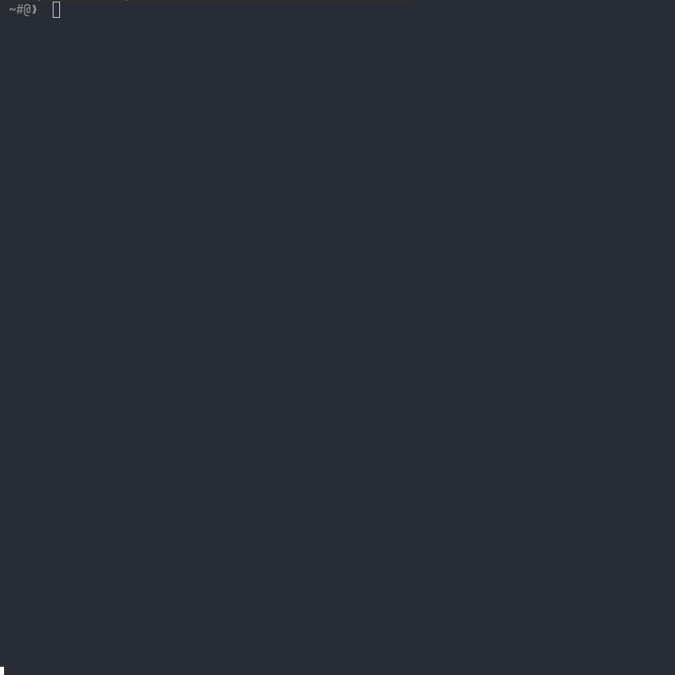

<h1 align="center">
  roscoe
  <br>
  <a href="https://github.com/robalyx/roscoe/blob/main/LICENSE">
    
  </a>
  <a href="https://github.com/robalyx/roscoe/actions/workflows/ci.yml">
    
  </a>
  <a href="https://github.com/robalyx/roscoe/issues">
    
  </a>
  <a href="CODE_OF_CONDUCT.md">
    
  </a>
  <a href="https://discord.gg/2Cn7kXqqhY">
    
  </a>
</h1>

<p align="center">
  <em>A globally-distributed API for checking Roblox accounts against a <a href="https://github.com/robalyx/rotector">Rotector</a> database, powered by Cloudflare.</em>
</p>

## 📚 Table of Contents

- [🎥 Demo](#-demo)
- [📋 Requirements](#-requirements)
- [🚀 Getting Started](#-getting-started)
- [📖 Usage Guide](#-usage-guide)
- [❓ FAQ](#-faq)
- [📄 License](#-license)

## 🎥 Demo

<p align="center">
  
</p>

Roscoe provides a **high-performance REST API** that integrates seamlessly with the [Rotector](https://github.com/robalyx/rotector) moderation system. The API lets you quickly check if any Roblox account has been flagged for inappropriate content.

Using our CLI tool, you can sync the latest data from Rotector's database to [Cloudflare D1](https://developers.cloudflare.com/d1/). The API runs on [Cloudflare Workers](https://developers.cloudflare.com/workers/), serving this data from edge locations worldwide. When accounts are flagged in Rotector, you can update D1 to make these changes available to all API users.

The API is built for speed and flexibility. You can check **single accounts** or **multiple accounts** at once. Each check tells you if an account is flagged and how confident we are about the flag. This makes it perfect for scanning friend lists or checking group members.

## 📋 Requirements

- [Go](https://go.dev/dl/) 1.23.2 or later
- [TinyGo](https://tinygo.org/getting-started/install/) 0.29.0 or later
- [Node.js](https://nodejs.org/en/download/)
- [PostgreSQL](https://www.postgresql.org/download/) 17.2 or later
- [Just](https://just.systems/man/en/chapter_1.html)
  - Installation packages [here](https://just.systems/man/en/packages.html)
- [Cloudflare Account](https://dash.cloudflare.com/)
- [Wrangler CLI](https://developers.cloudflare.com/workers/wrangler/)
  - Run `npm install -g wrangler`

## 🚀 Getting Started

1. **Clone and Setup**:
   ```bash
   # Clone the repository
   git clone https://github.com/robalyx/roscoe.git
   cd roscoe
   
   # Install dependencies
   go mod tidy
   ```

2. **Configure Environment**:
   ```bash
   # Copy the environment template
   cp .env.example .env
   
   # Edit .env with your settings:
   # - DATABASE_URL: PostgreSQL connection string
   # - ROSCOE_CF_ACCOUNT_ID: Your Cloudflare account ID
   # - ROSCOE_CF_D1_ID: Your D1 database ID (get from 'just setup-d1')
   # - ROSCOE_CF_API_TOKEN: Cloudflare API token
   # - CUSTOM_DOMAIN: Your custom domain
   ```

3. **Setup D1 Database**:
   ```bash
   just setup-d1
   ```

4. **Deploy Worker**:
   ```bash
   just deploy
   ```

5. **Generate API Key**:
   ```bash
   just add-key "Development API Key"
   ```

6. **Sync Flags**:
   ```bash
   just update-d1
   ```

## 📖 Usage Guide

### Managing API Keys

Roscoe uses API keys stored in D1 for authentication. You can manage these keys using the CLI:

```bash
# Add a new API key
just add-key "Key Description"

# List all API keys
just list-keys

# Remove an API key
just remove-key "your-api-key"
```

### API Endpoints

All requests **must** include the `X-Auth-Token` header with a valid API key.

#### Single Flag Lookup

```bash
GET /lookup/{user_id}

# Example
curl -X GET \
  -H "X-Auth-Token: your-api-key" \
  "https://your-worker.workers.dev/lookup/123456789"
```

#### Batch Flag Lookup

```bash
POST /lookup
Content-Type: application/json

{
  "ids": [123456789, 987654321]
}

# Example
curl -X POST \
  -H "X-Auth-Token: your-api-key" \
  -H "Content-Type: application/json" \
  -d '{"ids":[123456789,987654321]}' \
  "https://your-worker.workers.dev/lookup"
```

### Flag Values

- `0`: **No flag** - User has not been flagged or reviewed
- `1`: **Flagged** - User has been automatically flagged by the detection system for potential violations
- `2`: **Confirmed** - User has been reviewed and confirmed by moderators to have violations

Each flag also includes a confidence value between 0.0 and 1.0.

### API Response Format

#### Single Flag Lookup Response

```json
{
  "data": {
    "id": 123456789,
    "flag": 1,
    "confidence": 0.95
  }
}
```

For unflagged users (flag = 0), the confidence field is omitted:
```json
{
  "data": {
    "id": 123456789,
    "flag": 0
  }
}
```

#### Batch Flag Lookup Response

```json
{
  "data": [
    {
      "id": 123456789,
      "flag": 1,
      "confidence": 0.95
    },
    {
      "id": 987654321,
      "flag": 2,
      "confidence": 1.0
    },
    {
      "id": 456789123,
      "flag": 0
    }
  ]
}
```

## ❓ FAQ

<details>
<summary>Why use D1 instead of a traditional database?</summary>

Cloudflare D1 provides an ideal infrastructure for our REST API. The data is automatically replicated across Cloudflare's **global network**, ensuring that API requests are served from the nearest edge location with **minimal latency**.

</details>

<details>
<summary>How does the sync process work?</summary>

The sync process efficiently **transfers data** from your PostgreSQL database to D1 using batched operations. It creates a temporary table for the new data, then atomically swaps it with the main table to ensure zero-downtime updates. This approach maintains consistency while minimizing any potential impact on API performance.

</details>

<details>
<summary>Why is it called Roscoe?</summary>

The name "Roscoe" comes from old English slang meaning "weapon" or "firearm". We chose this name because this project acts as Rotector's weapon against inappropriate content.

</details>

## 📄 License

This project is licensed under the MIT License - see the [LICENSE](LICENSE) file for details.

---

<p align="center">
  Made with ❤️ by the robalyx team
</p>
